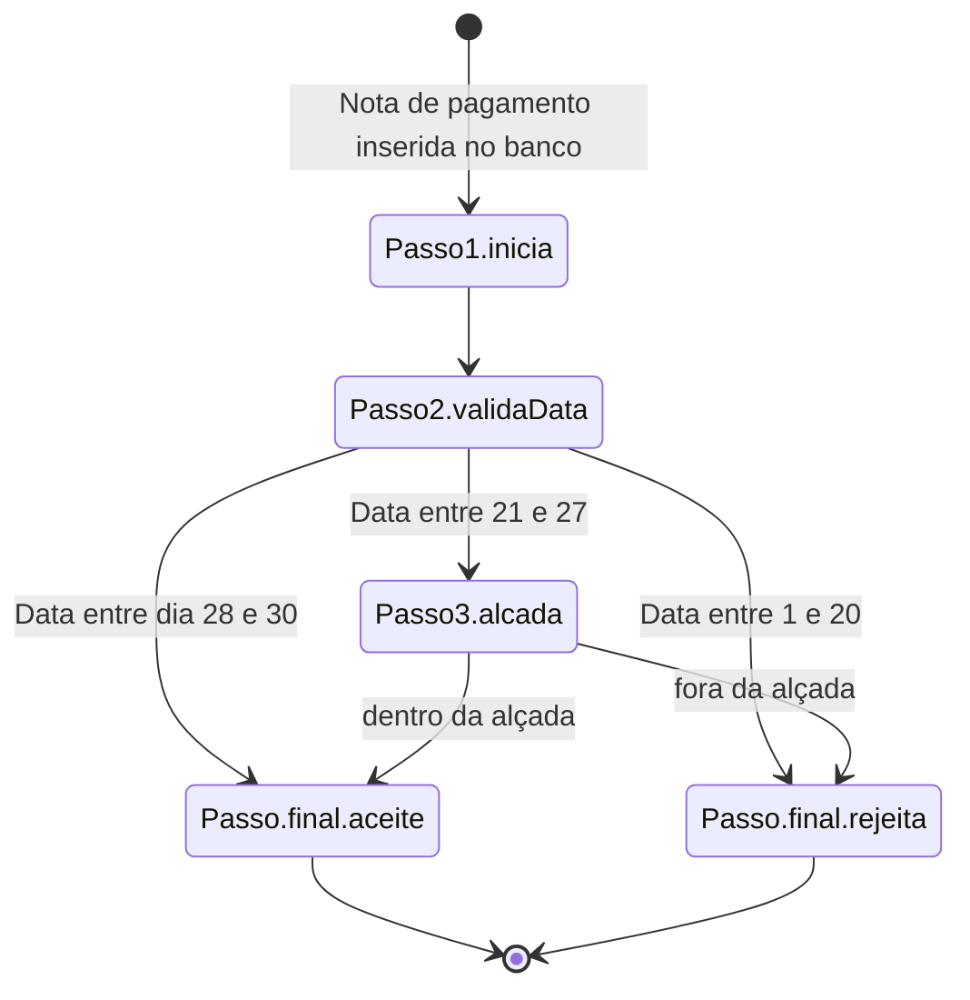

# messaging-sample

Este projeto tem como objetivo ilustrar uma arquitetura de fluxo de processamento onde a partir de um registro inserido no banco de dados uma sequência de mensagens são enviadas, sendo que a cada mensagem um receptor faz o processamento da mensagem, alteração do contéudo se necessário e encaminhamento para o próximo passo de acordo com um diagrama de estados.

A vantagem desta abordagem para fluxos de processamento complexos é que a implementação fica segmentada em cada passo, facilitando a manutenção e escalabilidade. A estrutura dos passos também é uma representação muito próxima de um diagrama de estados, o que facilita a documentação e comunicação do processo com a área de negócios.

A desvantagem é que um cuidado especial deve ser tomado na nomeação das filas e na guarda do mapa de estados. 

# Descrição do Exemplo

O exemplo está estruturado como uma série de containers docker orquestrados pelo `docker-composer`.

A estrutura de cada container foi criada para ser a mais simples possível, então a lógica de processamento foi reduzida a um mínimo e a validação de dados / tratamento de erros foi retirada. 

# Requisitos para executar o exemplo

Para rodar este exemplo são necessários 2 componentes:

- docker 
- make 

# Como executar o exemplo

para construir as imagens necessárias execute o comando

```shell
make build
```

para rodar o exemplo execute o comando
```shell
make up
```

para parar os containers execute o comando
```shell
make down
```

a composição possui seus próprios volumes, então ao parar/reiniciar os containers os dados do banco não são perdidos. O efeito colateral é que o container postgres não roda os scripts de inicialização caso o banco já exista, então se optar por alterar alguma coisa no banco através do arquivo init.sql será necessário apagar os volumes e recriá-los.

Para apagar os volumes e containers execute o comando
```shell
make clean
```

Uma vez os containers rodando dentro do docker, toda a interação é feita através do banco de dados. Para isso um container `pgadmin` está incluído na composição, sendo acessível pela porta `5050`:

http://localhost:5050/browser/

o usuário é `admin@example.com` e a senha é `admin`

um servidor já está configurado no container, ao acessar será pedido a senha que é `postgres`

O schema `public` possui 2 tabelas:

- notas: que armazena os dados das notas de pagamentos. Ela possui uma coluna `situacao` que assume os valores `'P'` para indicar que está em processamento, `'A'` para indicar que o pagamento foi aprocado e `'R'` para indicar que o pagamento foi rejeitdado
 - rejeitadas: caso um registro de pagamento tenha sido rejeitado, esta tabela conterá o id desse registro e uma descrição do motivo da rejeição.

 Cada passo está implementado como uma aplicação .NET8.0 em seu próprio container. O log do container terá informações sobre o recebimento e processamento da mensagem

# Como disparar as mensagens

As mensagens são disparadas através de um trigger de inserção na tabela notas. O arquivo `exemplos-notas-para-inserir.sql` possui vários exemplos. 

Abra uma aba de visualização dos dados das tabelas notas e rejeitadas e uma aba de consulta sobre a tabela notas na interface do `pgAdmin`. Copie um dos inserts do arquivo de exemplo e execute na tab de consulta. Os passos dos processamentos serão mostrados nos logs de cada container e atualizando a visualização das tabelas é possível ver o resultado final armazenado no banco.

